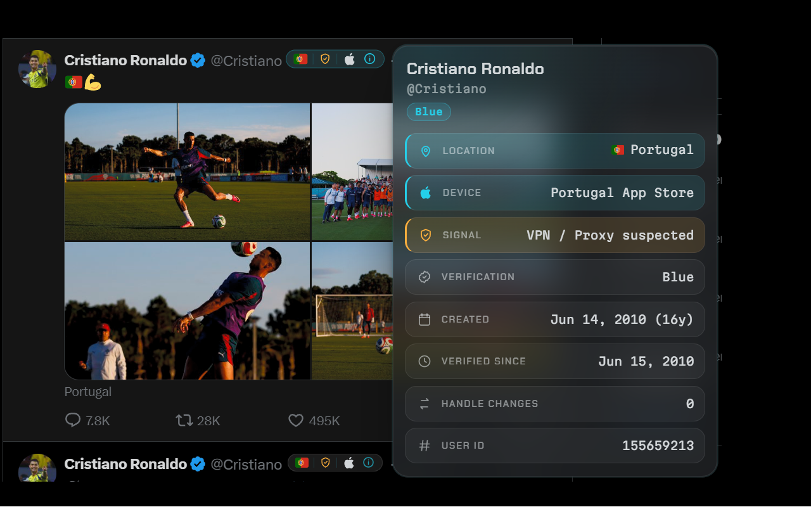
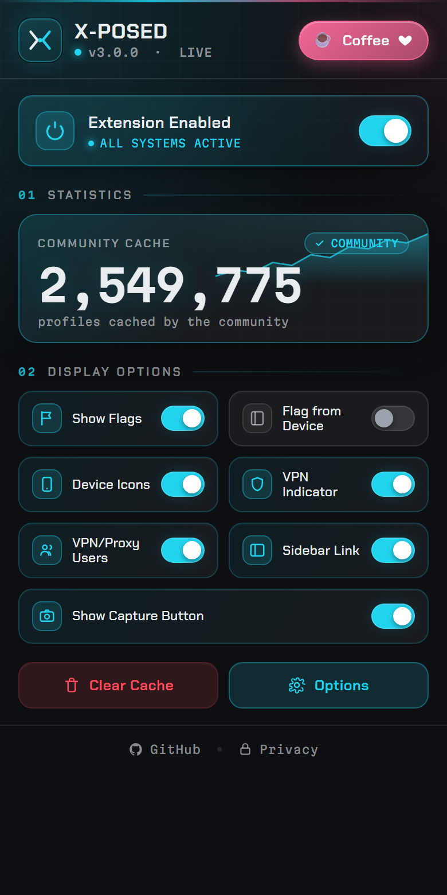
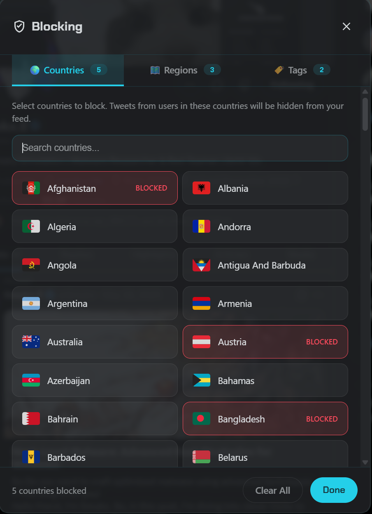

<h1 align="center">X-Posed</h1>

<p align="center"><b>See where any X account is posting from, without leaving your timeline.</b><br>
<b>Country, device, and VPN/proxy signals, inline next to every username.</b></p>

<p align="center">
<a href="https://chromewebstore.google.com/detail/x-account-location-device/oodhljjldjdhcdopjpmfgbaoibpancfk"></a>
<a href="https://addons.mozilla.org/en-GB/firefox/addon/x-posed-account-location-devic/"></a>
<a href="https://apps.apple.com/us/app/x-posed-location/id6755918713"></a>

</p>

X already knows where an account posts from. It's tucked inside the "About this account" panel almost nobody opens. X-Posed surfaces it for every username on your timeline: a country flag, a device icon, and a VPN/proxy hint, with a one-click dossier and location-aware filtering on top. No extra login, no independent geolocation, nothing beyond what X itself attributes.

## Screenshots


*Country flags and device icons land inline next to every account, right in the timeline.*



*Hover any badge for the full dossier: location, device, VPN/proxy signal, account age, verification, and ID.*



*The popup: every toggle, the live community-cache count, and one-click support.*



*Hide matching posts, or highlight them and stay aware.*

## Features

**At a glance.** Every account on the timeline gets inline signals next to the username:

- **Country flag**: the country X attributes to the account, drawn with Twemoji so it looks identical on every OS.
- **Device icon**: Apple (iPhone / iPad / Mac), Android, or Web.
- **VPN / proxy signal**: a lock badge when an account's location *may* be masked. It's a heuristic hint, not a verdict, so read it as a possibility rather than proof.
- **Circled-i**: a compact marker that opens the hover dossier.

**The hover dossier.** Hover the circled-i for a clean glass card with the full picture: location, device, VPN/proxy signal, account creation date and age, user ID, and verification / affiliation. Everything in one place, nothing buried.

**Take control.** Curate your timeline by where accounts post from:

- **Block by country, region, or tag**: single countries, multi-country regions (including groups like Southeast Asia), or display-name patterns.
- **Hide or Highlight**: remove matching posts entirely, or keep them visible with an amber accent so you stay aware without scrolling past blind.
- **VPN/proxy toggle**: show or hide posts from accounts flagged as possibly masked.
- **Sidebar link**: optionally inject a "Block Locations" entry straight into X's own navigation.
- **Flag from Device**: prefer the device's country for the flag instead of the account location (it falls back to location for web/unknown), and let blocking follow device country too.
- **Import / export**: back up or move your entire configuration in one file.

**Built for researchers.** *Share evidence* turns any post into a clean card overlaying location, device, VPN/proxy signal, account age, and engagement metrics, then lets you quote it, reply with it, or post it to your own timeline in one click (or just save the PNG). Human-confirmed and opt-in, made for OSINT work and source verification.

**Fast and private.**

- **Local cache**: an LRU store (~50k entries, ~2-week expiry, with negative caching for not-found) means an account is never looked up twice.
- **Optional community cache**: a privacy-first shared cache so flags load instantly and survive X's rate limits. On by default for new installs, fully optional, and entirely under your control. 2.5 million+ profiles cached by the community so far.
- **Rate-limit aware**: backoff, retries, and a live status indicator keep things smooth when X pushes back.
- **Light and dark**: auto-matches X's theme. v3.0.0 is a full "glass" redesign with distinctive bundled typography.
- **No tracking**: no analytics, no IP logging, no separate account.

## How it works

1. As you scroll, X-Posed spots usernames on the timeline.
2. For each one, it reads X's own "About this account" data (via X's `AboutAccountQuery`) using your existing X session. It's the same data you could open by hand, just surfaced automatically.
3. Results are cached locally (and optionally via the community cache) so repeat lookups are instant and rate limits stay out of your way.
4. Flags, device icons, and signals are rendered inline, with the full dossier a hover away.

## Install

| Platform | Get it |
| --- | --- |
| Chrome / Edge / Brave | [Chrome Web Store](https://chromewebstore.google.com/detail/x-account-location-device/oodhljjldjdhcdopjpmfgbaoibpancfk) |
| Firefox | [Firefox Add-ons](https://addons.mozilla.org/en-GB/firefox/addon/x-posed-account-location-devic/) |
| iOS / iPadOS | [App Store](https://apps.apple.com/us/app/x-posed-location/id6755918713) |

### Build from source

```bash
git clone https://github.com/xaitax/x-account-location-device.git
cd x-account-location-device/extension
npm install
npm run build          # builds both dist/chrome and dist/firefox
```

Then load it unpacked:

- **Chrome / Edge / Brave**: go to `chrome://extensions`, enable Developer mode, click **Load unpacked**, and select `dist/chrome`.
- **Firefox**: go to `about:debugging` &rarr; This Firefox &rarr; **Load Temporary Add-on**, and select any file inside `dist/firefox`.

Handy scripts while hacking:

```bash
npm run dev:chrome     # watch-mode rebuild for Chrome
npm run dev:firefox    # watch-mode rebuild for Firefox
npm run package        # produce distributable .zip files for both browsers
```

## Privacy

- X-Posed uses **X's public API with your existing session**. There's no separate account, login, or password.
- It reads only the "About this account" data X already exposes. It does **not** perform independent geolocation and does **not** touch private data.
- Lookups are **cached locally**. There's **no IP logging and no tracking or analytics**.
- The community cache is **optional** and **user-controlled**: a privacy-first shared layer for instant flags, nothing more.

## FAQ

**Does it work on private (protected) accounts?**
It surfaces whatever X attributes in the "About this account" panel. If X doesn't expose location or device for an account, there's nothing to show.

**Is the location always accurate?**
No, and we won't pretend otherwise. X-Posed reflects the country X attributes to an account, no more and no less, and the VPN/proxy badge is a *heuristic hint*. Treat both as signals to weigh, not guarantees.

**Do I need to log in or create an account?**
No. It rides your existing X session in the browser. There's no separate sign-up.

**Is my data shared with anyone?**
No tracking, no analytics, no IP logging. The only optional sharing is the community cache, which is privacy-first and fully under your control. Turn it off anytime.

**Why didn't a flag appear for someone?**
Either X exposes no location for that account, or the lookup is still catching up after a rate-limit backoff. Give it a moment, or check the status indicator.

## Contributing

Issues and pull requests are welcome. The extension lives in `extension/`. Run `npm install && npm run dev:chrome` to start hacking, and `npm run lint` before opening a PR. For anything bigger than a fix, open an issue first so we can talk it through.

## License

Released under the [MIT License](LICENSE).

---

<p align="center">
Built by <b>Alexander Hagenah</b> &middot; <a href="https://x.com/xaitax">@xaitax</a> &middot; <a href="https://primepage.de">primepage.de</a><br>
If X-Posed makes your timeline a little more honest, leave a &#11088;. It genuinely helps.
</p>
