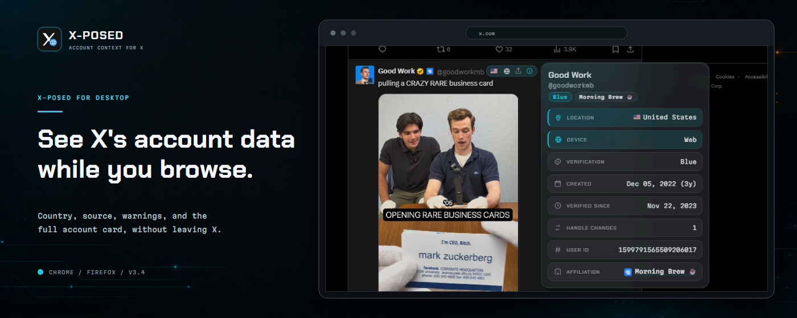
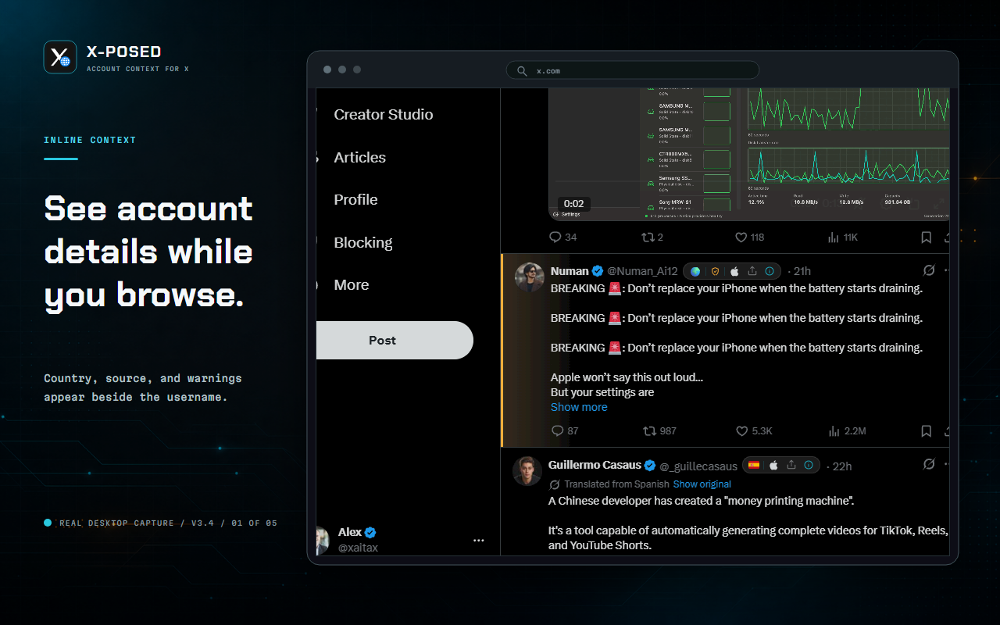
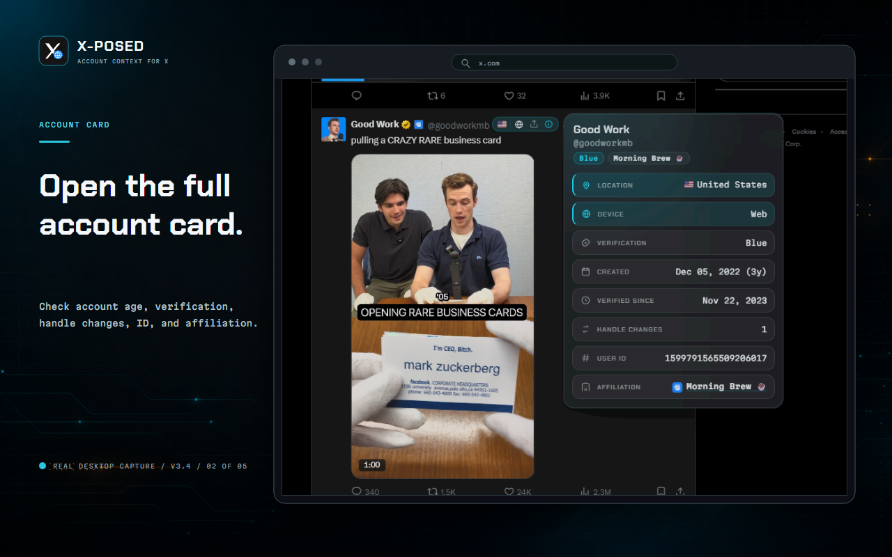
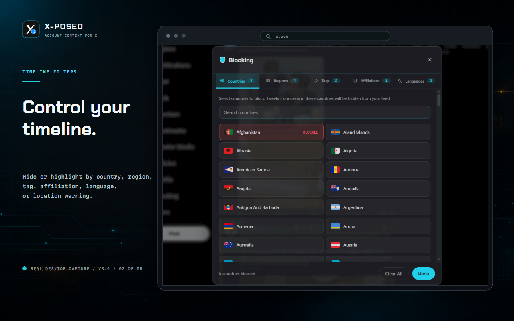
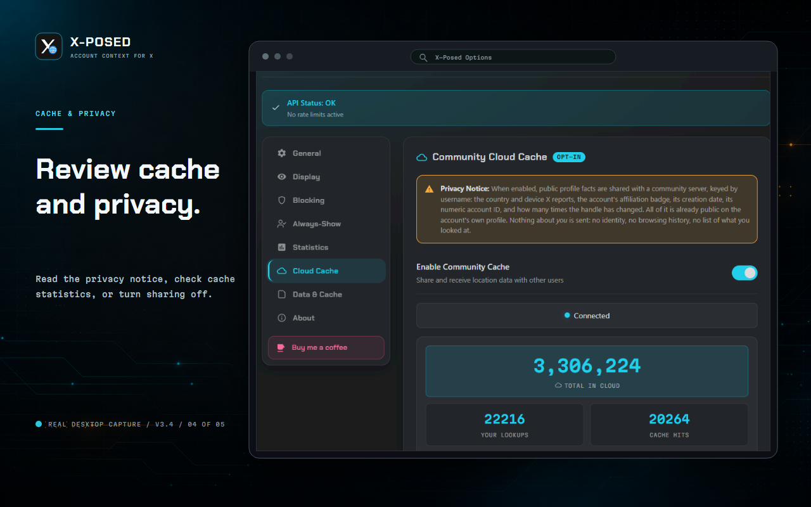
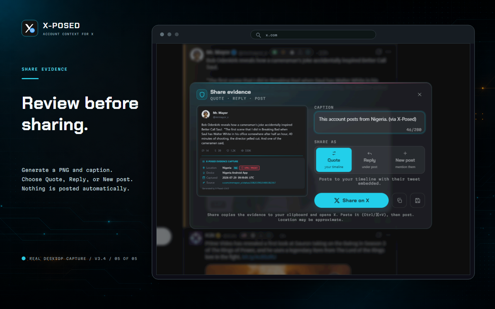

<p align="center">
  
</p>

<h1 align="center">X-Posed</h1>

<p align="center">
  <strong>See X's "About this account" data while you browse.</strong><br>
  Country, connection source, location warnings, account details, timeline filters, and shareable evidence.
</p>

<p align="center">
  <a href="https://chromewebstore.google.com/detail/x-posed-account-location/oodhljjldjdhcdopjpmfgbaoibpancfk"></a>
  <a href="https://addons.mozilla.org/en-GB/firefox/addon/x-posed-account-location-devic/"></a>
  <a href="https://apps.apple.com/us/app/x-posed-location/id6755918713"></a>
</p>

<p align="center">
  
  
  
  
  <a href="https://spdx.org/licenses/MIT.html"></a>
</p>

<p align="center">
  <a href="#what-it-does">Features</a> &nbsp;|&nbsp;
  <a href="#screenshots">Screenshots</a> &nbsp;|&nbsp;
  <a href="#read-the-data-correctly">Accuracy</a> &nbsp;|&nbsp;
  <a href="#privacy-and-permissions">Privacy</a> &nbsp;|&nbsp;
  <a href="#install">Install</a> &nbsp;|&nbsp;
  <a href="#development">Development</a>
</p>

X-Posed is a browser extension for Chrome and Firefox. It reads the same account fields that X shows in its **About this account** panel and puts the useful parts next to usernames.

> X-Posed is not a geolocation tool. It does not discover a person's physical location or inspect their device. It shows values returned by X. If X does not return a value, X-Posed has nothing to show.

## What it does

<table>
  <tr>
    <td width="33%"><strong>Inline account details</strong><br>Country flags, source icons, location warnings, and an account-info button beside usernames.</td>
    <td width="33%"><strong>Full account card</strong><br>Account age, verification, handle changes, account ID, affiliation, and the full source label.</td>
    <td width="33%"><strong>Timeline filters</strong><br>Hide or highlight by country, region, language, display-name tag, affiliation, or location warning.</td>
  </tr>
  <tr>
    <td><strong>Quoted posts and people lists</strong><br>Quotes can be collapsed on their own. Matching accounts in people lists are highlighted, never removed.</td>
    <td><strong>Share evidence</strong><br>Build a PNG locally, then use it in a Quote, Reply, or New post after reviewing it.</td>
    <td><strong>Your controls</strong><br>Choose which indicators appear, manage exceptions, clear local data, and turn the community cache off.</td>
  </tr>
</table>

X-Posed reads these X fields:

| X field | Used for |
| --- | --- |
| `account_based_in` | Country or regional label |
| `source` | Connection-source label and optional source-country flag |
| `location_accurate` | Possible VPN/proxy warning |

## Screenshots

<details>
<summary><strong>View the five-image product tour</strong></summary>

<br>

<table>
  <tr>
    <td width="50%"><a href="screenshots/marketing/01-inline-context.png"></a><br><strong>Inline account details</strong></td>
    <td width="50%"><a href="screenshots/marketing/02-account-card.png"></a><br><strong>Full account card</strong></td>
  </tr>
  <tr>
    <td><a href="screenshots/marketing/03-timeline-filters.png"></a><br><strong>Timeline filters</strong></td>
    <td><a href="screenshots/marketing/04-display-controls.png"></a><br><strong>Cache and privacy controls</strong></td>
  </tr>
  <tr>
    <td colspan="2" align="center"><a href="screenshots/marketing/05-share-evidence.png"></a><br><strong>Share evidence</strong></td>
  </tr>
</table>

</details>

<details>
<summary><strong>Feature details</strong></summary>

### Inline details and account card

Each supported username can receive a Twemoji country flag, an Apple, Android, Web, or unknown source icon, a location warning, an account-info button, and an optional share button.

**Flag from Device** uses a country found at the start of a source label, such as `Portugal App Store`. If no country can be read from the source, it falls back to the account location. Country filtering uses the same effective country.

The full account card can show:

- Display name and handle
- Country or region
- Full connection-source label and location warning
- Blue, legacy, and identity verification state
- Protected-account state
- Account creation date and age
- Verification date, when X provides one
- Handle-change count and numeric account ID
- Affiliation or parent organisation

Opening the card requests a full record when the timeline cache contains only the smaller badge record. On touch devices, tapping the badge opens the card as a mobile sheet.

### Timeline filters

Filters are available in Options and through the optional **Blocking** link in X's sidebar.

| Filter | Value used |
| --- | --- |
| Country | X's account country, or the source country when Flag from Device is enabled |
| Region | An exact regional label returned by X, such as Europe or South Asia |
| Display-name tag | Case-insensitive text in the display name |
| Language | The post's `lang` value supplied by X |
| Affiliation | The organisation name or affiliated username returned by X |
| VPN/proxy warning | `location_accurate: false` |

- **Hide mode** removes matching posts.
- **Highlight mode** keeps matching posts visible with an amber marker.
- **Always-Show Accounts** exempts selected handles from every filter.
- The first-run Always-Show list contains `@xaitax`. It is not added again after removal.
- A matching author inside a quoted post collapses only the quote card for country, region, tag, language, and affiliation filters.
- VPN filtering applies only to a post's own author, not the author inside its quote.
- Matching accounts in Followers, Following, search results, and other people lists are highlighted but never removed.
- The language value `und` is never blocked.
- Changing a filter rechecks posts already on the page.

Older community-cache records may not contain affiliation data. Opening the account card performs the full lookup and can add that data to future cache records. Enabling the affiliation filter does not make extra X requests for every timeline account.

### Share evidence

The share button builds a PNG in the browser with the post author, text, first attached image, metrics, account country, source label, location warning, capture time, original URL, and X-Posed version.

The share dialog supports Quote, Reply, and New post. Desktop browsers copy the image and open X's composer. Supported mobile browsers use the system share sheet. The image can also be saved. X-Posed never submits the post automatically.

### Popup and Options

The popup covers the controls used most often: extension state, flags, source icons, warnings, sharing, source-country flags, sidebar link, cache count, and local-cache clearing.

Options contains all filters, the Always-Show list, theme handling, cache controls, community-cache controls, statistics, configuration export, update preferences, and debug mode.

</details>

## Read the data correctly

- **Country or region:** This is what X attributes to the account. It is not a live physical location. X-Posed does not infer a geographic region from a country.
- **Connection source:** This is account-level data. It does not prove which device created a particular post.
- **Location warning:** `location_accurate: false` can indicate a VPN or proxy, but it is not proof that one is in use.
- **Community records:** These are shared client contributions. They can be stale or wrong, so important findings should be checked against X.
- **Platform changes:** X can change its GraphQL query, response format, or page markup. Any of these changes can temporarily break the extension.

## Privacy and permissions

The browser extension contains no analytics or advertising code and does not require an X-Posed account. It uses the X session already open in the browser.

To call X's AboutAccount endpoint, the extension captures X authorization and CSRF headers and stores them in extension-local storage. Those headers are sent only to X. They are never sent to the community cache.

When the community cache is enabled, X-Posed can contribute the public handle, country or region, source label, location-accuracy value, affiliation, account creation time, numeric account ID, and handle-change count. It does not send post text, direct messages, biographies, profile images, email addresses, follower lists, or X session headers to the cache.

Evidence images are created locally. Nothing is copied, saved, or shared until the user chooses to do so.

| Permission | Reason |
| --- | --- |
| `storage` | Store settings, filter lists, X request headers, and cached account data |
| `x.com` and `twitter.com` | Read supported page elements and request AboutAccount data from X |
| `x-posed-cache.xaitax.workers.dev` | Look up and contribute community-cache records |

See [PRIVACY.md](PRIVACY.md) for the separate privacy policy. X-Posed is independent and is not affiliated with or endorsed by X Corp.

## Install

| Platform | Link | Minimum version |
| --- | --- | --- |
| Chrome, Edge, Brave, and other Chromium browsers | [Chrome Web Store](https://chromewebstore.google.com/detail/x-posed-account-location/oodhljjldjdhcdopjpmfgbaoibpancfk) | Chrome 111 or compatible |
| Firefox desktop | [Firefox Add-ons](https://addons.mozilla.org/en-GB/firefox/addon/x-posed-account-location-devic/) | Firefox 140 |
| Firefox for Android | [Firefox Add-ons](https://addons.mozilla.org/en-GB/firefox/addon/x-posed-account-location-devic/) | Firefox for Android 142 |
| iPhone and iPad | [App Store](https://apps.apple.com/us/app/x-posed-location/id6755918713) | iOS or iPadOS 15.1 |

The iPhone and iPad app is a separate companion app with a username lookup interface. Its source is not part of this browser-extension repository.

<details>
<summary><strong>Lookup, caching, and community-cache details</strong></summary>

### Lookup order

```text
Visible username
      |
      v
Negative cache, then local cache
      | miss
      v
Community cache, if enabled
      | miss
      v
X AboutAccountQuery
      |
      v
Badge, account card, and filter result
```

1. The content script watches X's changing page and queues visible usernames.
2. A script in X's page context observes the authorization and CSRF headers used by X's own GraphQL requests.
3. The headers are stored in extension-local storage and used only for requests to X.
4. The background script checks the negative cache, local cache, community cache, and finally X.
5. Requests for the same handle share one in-flight promise.
6. The primary background parser checks that X returned the requested handle before contributing it to the shared cache.
7. If the background request cannot use the correct X session, the content script can retry inside the page. This helps with Firefox containers.

X frequently replaces and reuses page elements while scrolling. X-Posed keeps filter state in persistent data attributes so hidden or highlighted posts remain correct after those updates.

### Cache limits

| Cache | Limit and lifetime | Purpose |
| --- | --- | --- |
| Negative cache | Up to 1,000 entries for 5 minutes | Avoid repeated requests for unresolved handles |
| Content-script cache | Up to 1,000 users per page session | Avoid repeated background messages while scrolling |
| Account-card cache | Up to 200 users for 60 seconds | Avoid repeated full lookups between cards |
| Local extension cache | Up to 50,000 entries for 60 days | Keep common account data across restarts |
| Community cache | 60-day Worker KV lifetime | Reuse public account data between users |

The local cache stores location, source, accuracy, and affiliation state. Names, avatars, verification details, and most other card fields normally stay in memory. If extension storage reaches its quota, X-Posed removes the oldest quarter of the cache and retries.

The community cache is enabled for new browser-extension installs and can be disabled in Options. Direct X lookups and the local cache still work when it is off, subject to X's rate limits.

The cache Worker validates contribution format and size, then stores the last accepted value for a handle. It does not cryptographically prove that a contribution came from X. The Worker uses Cloudflare's connecting-IP header for an in-memory limit of 60 requests per minute and does not write that IP value to KV. Cloudflare still processes the request under its own infrastructure and policies.

</details>

## Development

<details>
<summary><strong>Build, test, and source layout</strong></summary>

The browser extension requires Node.js 18 or newer.

```bash
git clone https://github.com/xaitax/x-account-location-device.git
cd x-account-location-device/extension
npm install
npm run lint
npm run build
```

The build creates `extension/dist/chrome` and `extension/dist/firefox`.

- Chrome: open `chrome://extensions`, enable Developer mode, choose **Load unpacked**, and select `extension/dist/chrome`.
- Firefox: open `about:debugging`, choose **This Firefox**, choose **Load Temporary Add-on**, and select a file inside `extension/dist/firefox`.

| Command | Action |
| --- | --- |
| `npm run dev:chrome` | Build Chrome in watch mode |
| `npm run dev:firefox` | Build Firefox in watch mode |
| `npm run lint` | Run ESLint and the parser-field check |
| `npm run build` | Build Chrome and Firefox |
| `npm run package` | Build ZIP packages for both stores |

| Path | Contents |
| --- | --- |
| `extension/src/content/` | Page observation, badges, filtering, account card, blocking modal, and evidence capture |
| `extension/src/background/` | X API client, request queue, cache resolution, cloud client, and message handling |
| `extension/src/shared/` | Constants, browser compatibility, storage, normalization, and LRU cache |
| `extension/src/popup/` | Popup UI |
| `extension/src/options/` | Options UI |
| `extension/scripts/` | Packaging and parser-field checks |
| `userscript/` | Older userscript that is not feature-equivalent to the extension |

### Contributing

Issues and pull requests are welcome.

1. Search the [issue tracker](https://github.com/xaitax/x-account-location-device/issues) first.
2. Keep Chrome and Firefox behavior in sync.
3. Run `npm run lint` and `npm run build` from `extension/`.
4. Do not include X cookies, authorization headers, or other session data in bug reports.

See [CHANGELOG.md](CHANGELOG.md) for the release history.

</details>

## Support and license

- [Report a bug or request a feature](https://github.com/xaitax/x-account-location-device/issues)
- [Support development on Ko-fi](https://ko-fi.com/M4M61EP5XL)
- Follow [@xaitax](https://x.com/xaitax) on X

The browser extension is released under the [MIT License](https://spdx.org/licenses/MIT.html).

<p align="center">
  Built by <strong>Alexander Hagenah</strong> | <a href="https://primepage.de">primepage.de</a>
</p>
