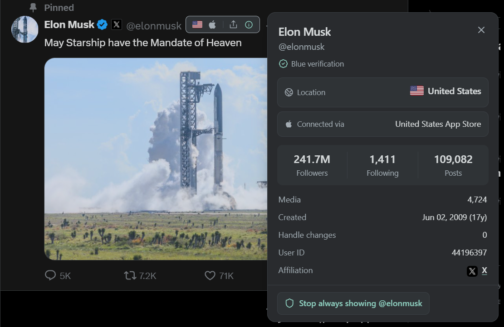
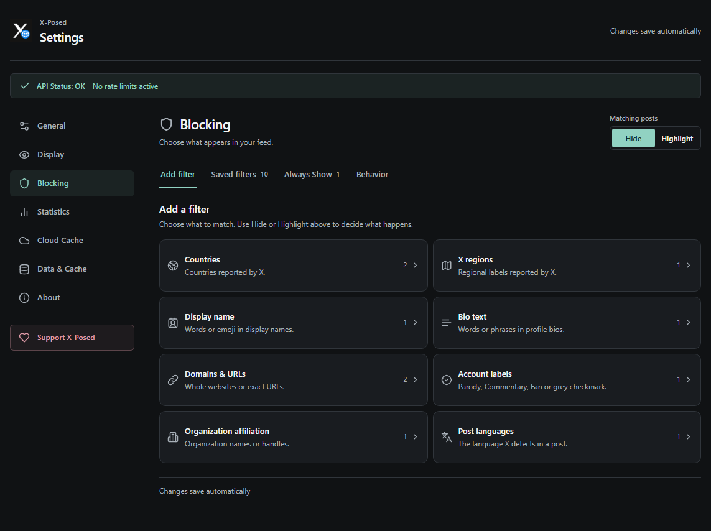
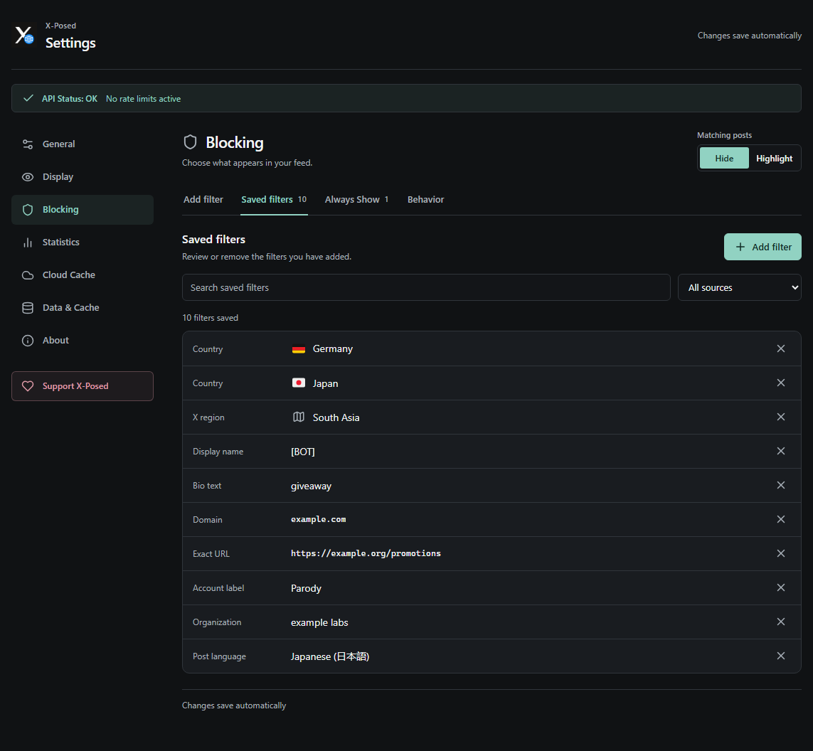
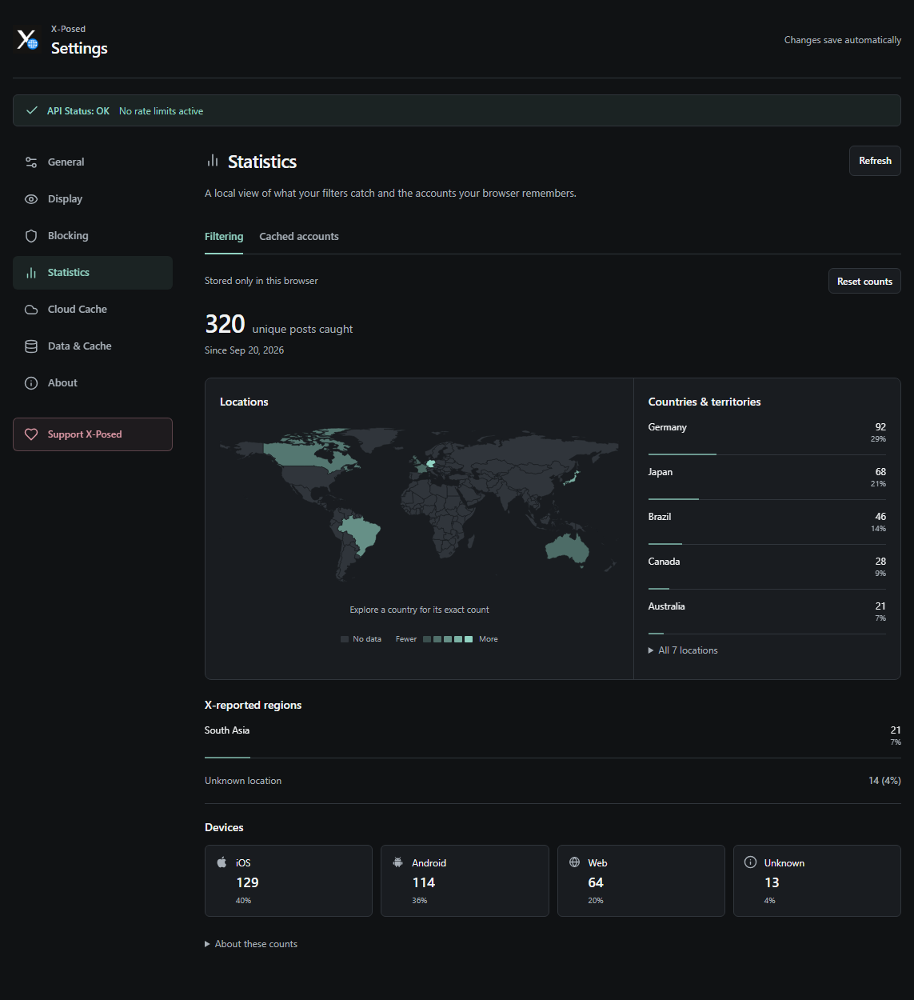
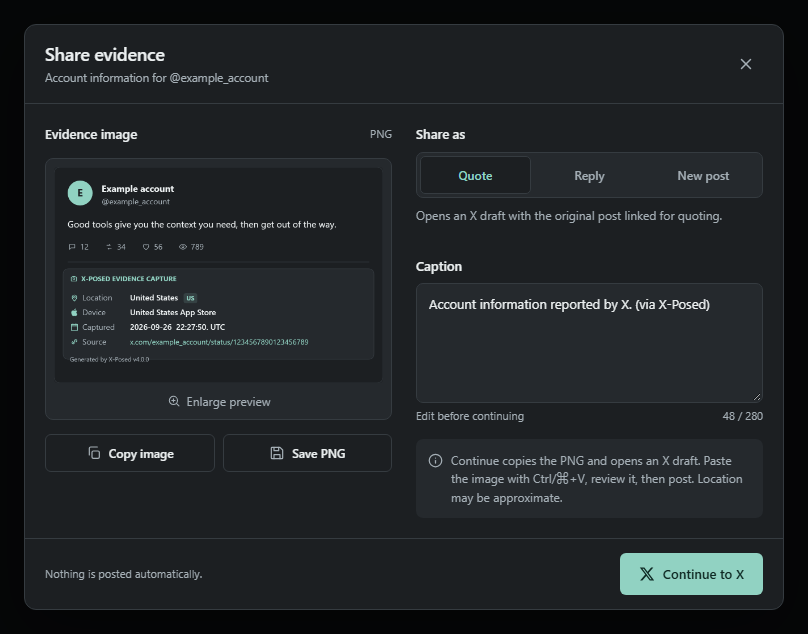
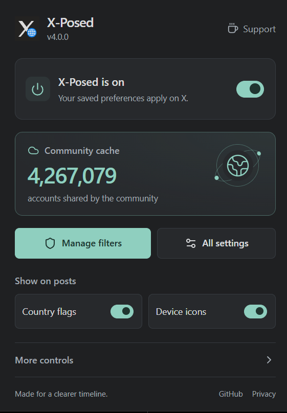

<p align="center">
  
</p>

<h1 align="center">X-Posed</h1>

<p align="center">
  <strong>More context about the accounts in your timeline.</strong><br>
  See X's account country and connection source, filter your feed, and share what you find.
</p>

<p align="center">
  <a href="https://chromewebstore.google.com/detail/x-posed-account-location/oodhljjldjdhcdopjpmfgbaoibpancfk"></a>
  <a href="https://chromewebstore.google.com/detail/x-posed-account-location/oodhljjldjdhcdopjpmfgbaoibpancfk"></a>
  <a href="https://chromewebstore.google.com/detail/x-posed-account-location/oodhljjldjdhcdopjpmfgbaoibpancfk"></a>
  <a href="https://addons.mozilla.org/en-GB/firefox/addon/x-posed-account-location-devic/"></a>
  <a href="https://addons.mozilla.org/en-GB/firefox/addon/x-posed-account-location-devic/"></a>
</p>

<p align="center">
  <a href="CHANGELOG.md">Version 4.2</a> ·
  <a href="#features">Features</a> ·
  <a href="#screenshots">Screenshots</a> ·
  <a href="#filtering">Filtering</a> ·
  <a href="PRIVACY.md">Privacy</a> ·
  <a href="#support">Support</a>
</p>



*Account details in the X-Posed 4.0 interface.*

X-Posed is a free, open-source browser extension for Chrome and Firefox. It brings information from X's **About this account** panel into the timeline, alongside optional filters, local statistics and sharing tools.

**It shows what X reports, not a person's live location or the device used for a particular post.** Missing data stays unknown, and a location warning is not proof of VPN use.

## Install

| Browser | Download | Minimum version |
| --- | --- | --- |
| Chrome and compatible browsers, including Edge and Brave | [Chrome Web Store](https://chromewebstore.google.com/detail/x-posed-account-location/oodhljjldjdhcdopjpmfgbaoibpancfk) | Chrome 111 or compatible |
| Firefox desktop | [Firefox Add-ons](https://addons.mozilla.org/en-GB/firefox/addon/x-posed-account-location-devic/) | Firefox 140 |
| Firefox for Android | [Firefox Add-ons](https://addons.mozilla.org/en-GB/firefox/addon/x-posed-account-location-devic/) | Firefox for Android 142 |

Install the extension, reload X, and browse while signed in. Open an account badge for details, or choose **Manage filters** in the extension popup to configure your timeline.

This README describes source version 4.2.0. Browser-store updates roll out separately. For local installation, see [Build from source](#build-from-source).

**iPhone and iPad:** a separate [X-Posed Location companion app](https://apps.apple.com/us/app/x-posed-location/id6755918713) offers username lookups. It is not the browser extension and does not provide the same timeline features.

## Features

- **Account context, inline.** Country flags, Apple/Android/Web source icons and location warnings beside usernames. Choose which indicators you see, select Small/Medium/Large badges, or turn off the background for icons only. Preview changes in **Settings → Display**.
- **Compact account details.** Open a badge for country, connection source, account age, blue/gold/grey verification, handle changes, affiliation and follower, following, post and media counts, where available. Hover, click and touch controls are supported. Icon-only Copy PNG and Save PNG controls export the card's current design locally, without buttons or surrounding posts; use Save PNG when image copying is unavailable.
- **Your timeline, your filters.** Hide matching posts or keep them visible with a subtle highlight. Search saved rules and exempt accounts with **Always Show**.
- **Local statistics.** See how many identifiable posts your filters catch, with country, region and device breakdowns. Explore world maps for filtering activity and locally cached accounts.
- **Share evidence.** Preview an image, edit its caption, then choose Quote, Reply or New post, or save the image. You review and submit the post yourself.
- **Consistent controls.** Light and dark themes, a compact popup, the optional Blocking link in X's sidebar, settings backups and a configurable Hide/Highlight keyboard shortcut.
- **Community cache.** Reuse public account records shared by the community to reduce repeat X lookups. You can turn it off and continue using direct X lookups and your local cache.

Version 4.2 brings a heavily requested addition: region filters can match X's region label **and the countries you choose inside it**. Browse each region's flags, pick a few countries or include them all; existing region filters stay label-only until you opt in. Refined account cards also gain icon-only **Copy PNG** and **Save PNG** actions. Read the [changelog](CHANGELOG.md) for the release details.

## Filtering

Open **Manage filters** from the popup, **Settings → Blocking**, or the optional **Blocking** link in X's sidebar. Choose **Add filter**, select a type, and add your rules. Use **Saved filters** to search or remove them, **Always Show** for exceptions, and **Behavior** for filtering preferences.

Choose **Hide** to remove matching posts or **Highlight** to keep them readable. Saved changes recheck posts already on the page. A match on any applicable rule is enough.

| Filter | Matches |
| --- | --- |
| Countries and X regions | The account's reported country or regional label, or the source country if selected |
| Display name and bio text | Case-insensitive words or phrases; display-name rules also support emoji |
| Domains and URLs | Profile websites and bio links: a whole domain, including subdomains, or one exact URL |
| Account labels | Parody, Commentary, Fan, or the account's grey government/multilateral checkmark |
| Organization affiliation | An observed organization name or handle |
| Post language | The language X assigns to the displayed post text |
| Activity & names | Minimum Following or Total posts, plus separate handle and display-name digit rules |
| Location warnings | Accounts whose location X marks as potentially inaccurate |

Filters affect what you see locally. They do not block or mute accounts on X.

### Matching and exceptions

- **Regions can include countries.** Expand a region under **Add filter → Regions** to browse its flags. Choose individual countries, or enable **Include countries** to select them all; either action automatically enables the region. Customize the list with individual checkboxes or **All / None**. Existing filters stay label-only until you opt in. Regions can overlap, so excluding a country in one does not override another matching filter. Membership follows [UN M49 geography](https://unstats.un.org/unsd/methodology/m49/) with documented composite groups, not a claim about X's boundaries. Antarctica remains country-only.
- **Choose the location source.** Enable **Behavior → Use device country when available** to use a country from the connection-source label, falling back to the account location. This affects both flags and country/region filters.
- **Always Show takes priority.** Exempt accounts from its tab or their account card. Your own recognized account is exempt too. New installs include `@xaitax` in Always Show; removing it is respected.
- **Accounts you follow can be exempt too.** Enable **Always Show → Always show accounts I follow**, off by default. It applies as X loads follow status; already-loaded accounts may need a refresh or further browsing. Confirmed followed accounts bypass filters, while unknown status uses normal filtering. No extra requests are made, and **Use profile details** can remain off. Follow status stays in page-session memory, is cleared when the signed-in account changes, and is never uploaded or backed up. Only the preference is included in backups. Quoted authors are checked independently.
- **Quotes keep their own rules by default.** A matching quoted account can collapse independently, with a **Show quoted post** control and the matching reasons. Language and location-warning filters apply to the enclosing post, not independently to its quoted author.
- **Hide related posts, optionally.** Enable **Behavior → Hide replies and quotes of filtered posts** to collapse whole replies and quotes, even when their source is only highlighted. Each gets a reason and **Show post** control. This uses relationships X already loads, without extra requests. Unknown sources keep normal filtering, and existing exceptions still apply. Authors are not added to your filters.
- **Opened posts stay readable.** A main post identified by its own permalink is highlighted rather than hidden when deliberately opened. Replies retain their normal rules. Matching accounts in people lists are highlighted, never removed.
- **Missing information is not guessed.** Language filtering uses X's displayed-text language marker; auto-translation can make the original language unavailable. Unknown languages are not filtered, and government status requires the account's own grey checkmark.

### Domains and exact URLs

Under **Add filter → Domains & URLs**, `example.com` matches that site and its subdomains. `example.com/channel` becomes an exact rule for `https://example.com/channel`, not the whole site. An explicit HTTP(S) URL, query or fragment also creates an exact rule.

Exact rules preserve the hostname, scheme, path case, trailing slash, query and fragment after standard URL parsing. They do not include child pages. Redirects and short links are not followed; unavailable destinations stay unknown. Existing domain rules remain domain rules.

Bio-text and link filters each have a default-off option to also check self-written **profile location text**. This is separate from X's account-country label. **Behavior → Use profile details** controls access to the profile data X already loads, without requesting missing profiles.

### Activity & names

Under **Add filter → Activity & names**, choose a rule from two groups:

- **Activity:** Following and Total posts, with presets and custom minimums.
- **Name patterns:** Handle digits and Display-name digits, each with its own minimum.

All four rules are independent and off until added. Each has one editable threshold: **5,000 or more** includes exactly 5,000. Following means accounts followed, not followers; Total posts is X's reported total, not a daily rate.

Following and Total posts use counts X already loads and update when new counts are observed. Unknown counts do not match. Turning off **Behavior → Use profile details** leaves these two rules saved but inactive.

**Handle digits** counts all digits in the actual `@handle`, not the display name. The suggested minimum is **5**, adjustable from **1 to 15**: `@alex1990` has four digits, while `@a1b2c3d4e5` has five.

**Display-name digits** is a separate rule, also suggested at **5**, adjustable from **1 to 50**. It counts decimal digits, including styled and non-Latin digits, in the displayed name. Digits in a name and handle are never added together; missing names do not match.

Both digit rules work even with profile details disabled. All four rules need no additional lookups, are included in backups and respect the usual exceptions.

### Location warnings and keyboard shortcut

Enable **Behavior → Filter accounts with location warnings** to include them in Hide/Highlight. A warning indicates uncertainty, not confirmed VPN use.

You can assign **Switch matching posts between Hide and Highlight** in your browser's extension-shortcut settings. No shortcut is assigned by default; the Blocking link in X's sidebar remains navigation only.

## Statistics and data controls

**Statistics → Filtering** counts identifiable matching posts once across tabs and browser restarts, whether hidden or highlighted. Counting starts as you browse, with no history backfill. Quotes need their own reliable post ID; a quote removed with its hidden parent is not counted separately. These are cumulative totals, not a live timeline count or per-rule counters.

**Cached accounts** is a separate view of your browser's account cache, not the community cache. Both views have country heatmaps and exact-count lists, with X regions and unknown locations listed separately. Small countries missing from the map remain in the lists. Statistics use existing data without extra lookups and are not uploaded or exported.

| Control | What it does |
| --- | --- |
| Statistics → Filtering → Reset counts | Removes filtering totals and deduplication fingerprints, without changing filters or cached accounts |
| Data & Cache → Clear Cache | Clears locally cached account details, not community records or filtering statistics |
| Data & Cache → Export Data | Backs up all settings and filters, Always Show accounts, theme, community-cache preference and local cached accounts, but not X headers or statistics |
| Data & Cache → Import Data | Validates settings and filters before restoring them, preserves fields missing from older backups, and skips outdated or invalid cached accounts without replacing newer observations |

The local account cache holds up to 50,000 accounts for up to 60 days. Downloading a shared record preserves its remaining lifetime rather than making it fresh again. Treat exported files as private.

## Sharing

The badge's share button prepares an image locally with the selected post's available text, first attached image, metrics and account information, plus capture time, original URL and extension version. It is not a full thread or video archive.

Review the preview and caption, then choose Quote, Reply or New post. Desktop browsers copy the image and open X's composer; paste the image if needed. Supported mobile browsers can use their share sheet, and **Save PNG** downloads the image. Nothing is posted automatically.

## Screenshots

Screenshots show the 4.0 interface. Filter, statistics and sharing examples use demonstration data. Select an image to view it at full size.

<table>
  <tr>
    <td width="50%" valign="top"><a href="screenshots/v4/add-filter.png"></a><br><strong>Add a filter</strong><br>Choose a filter type without searching through settings.</td>
    <td width="50%" valign="top"><a href="screenshots/v4/blocking.png"></a><br><strong>Manage your rules</strong><br>Saved filters, Always Show and Behavior in one place.</td>
  </tr>
  <tr>
    <td valign="top"><a href="screenshots/v4/statistics.png"></a><br><strong>Understand your filters</strong><br>Local counts and maps, without additional account lookups.</td>
    <td valign="top"><a href="screenshots/v4/share.png"></a><br><strong>Review before sharing</strong><br>Preview the image and choose how to use it.</td>
  </tr>
</table>

### Browser popup

<p align="center"></p>

## Privacy and accuracy

- No X-Posed account, usage analytics or advertising. Filtering statistics remain in your browser.
- The extension uses your existing X session. Captured authorization and CSRF headers are stored locally and sent only to X, never to the community cache.
- The community cache is **enabled on new installs** and can be disabled under **Settings → Cloud Cache**. It shares public handles and account metadata, not post text, biographies, private messages or session headers. These records are identifiable, not anonymous.
- Profile text, links, labels and counts read from X's existing timeline responses stay in page-session memory. This can be disabled under **Blocking → Behavior → Use profile details**.
- X's labels and shared cache records can be incomplete, stale or incorrect. Important findings should be checked against X. Rate-limit handling cannot guarantee protection from X's account enforcement.

Read the [privacy policy](PRIVACY.md) for data flows, permissions and retention. X-Posed is independent and is not affiliated with or endorsed by X Corp.

## Support

X-Posed is free and open source. **A huge thank you to everyone who has donated.** Your support helps cover development and the community cache of over four million accounts. There is no need to donate, but it helps tremendously.

**[Buy me a coffee on Ko-fi](https://ko-fi.com/M4M61EP5XL)** or donate **BTC, ETH or USDC**. Crypto support was added by request. Copy addresses in **Settings → About** or use the addresses below.

### Crypto donations

**Bitcoin (BTC) · Network: Bitcoin**

```text
35r5XS95AuvNcLqw13ULwH8XifQD9WxddX
```

**Ethereum (ETH) and USD Coin (USDC) · Network: Ethereum / ERC-20**

```text
0xDeB8e90373C121EcCB9693f8Ff2D4f39ea55f5c0
```

Check the network before sending. Send BTC on Bitcoin, and ETH or USDC on Ethereum only. ETH and USDC intentionally share the same receiving address.

## Build from source

Use Node.js 18 or newer and npm.

```bash
git clone https://github.com/xaitax/x-account-location-device.git
cd x-account-location-device/extension
npm ci
npm run lint
npm run build
npm run check:build
```

- **Chrome:** open `chrome://extensions`, enable Developer mode, select **Load unpacked**, and choose `extension/dist/chrome`.
- **Firefox:** open `about:debugging`, choose **This Firefox → Load Temporary Add-on**, and select `extension/dist/firefox/manifest.json`. This development installation is temporary.

Reload the extension and refresh open X tabs after rebuilding. Use `npm run dev:chrome` or `npm run dev:firefox` for watch mode, and `npm run package` to create both store-upload ZIPs in `extension/dist/`.

The browser extension lives in `extension/src/`, grouped into content scripts, background services, shared modules, settings, popup and styles. The older `userscript/` is not feature-equivalent to the extension.

## Contribute

[Report a bug or suggest a feature](https://github.com/xaitax/x-account-location-device/issues). Include browser/extension versions and reproduction steps. Never include cookies, authentication headers, private account data or unredacted network logs.

For code contributions, keep changes focused, preserve existing preferences and reuse the shared filtering and settings modules. Run the checks above and verify Chrome and Firefox. UI changes should cover light/dark themes; filter changes should cover Hide/Highlight, Always Show, quoted and opened posts, and cross-tab settings updates.

Thank you to everyone who contributes code, reports bugs, shares ideas, tests releases or supports development. Release-specific credits are in the [changelog](CHANGELOG.md).

Built by [Alexander Hagenah](https://primepage.de) · [@xaitax](https://x.com/xaitax) · [MIT License](https://spdx.org/licenses/MIT.html)
